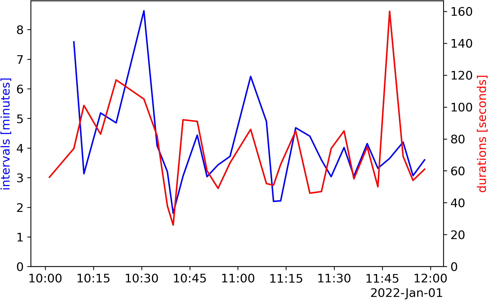

# Childbirth Contraction Timer

# Usage
Type
```bash
python timer.py
```
in your terminal. When a contraction starts, hit enter. When it stops, hit enter again. When the next one starts, hit enter again. And so on.
The information will be printed on screen, and it is also written to a text file called `log.txt`.
- If you accidentally quit the program even though you didn't mean to, you can just restart it. The program loads the `log.txt` file and will continue from there. You do not have to press Enter after restarting. Just wait until the contraction stops or the next one starts and continue to press Enter like before.
- If you accidentally pressed Enter twice, close the program, open `log.txt` and delete the last two lines. Then restart the program.

# Plotting
In order to get a visual representation of the contractions, type
```bash
python plot.py
```
in your terminal.


Here is an example of a visualization of a real-world log (log and plot found in examples folder):


